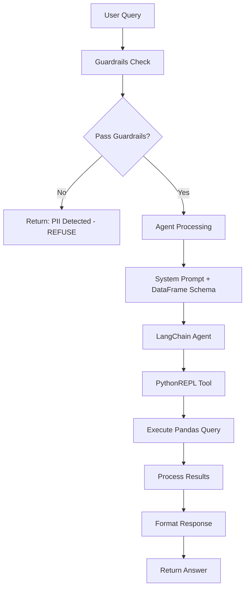
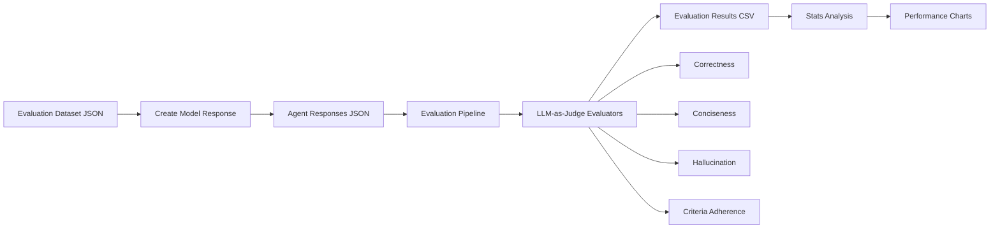
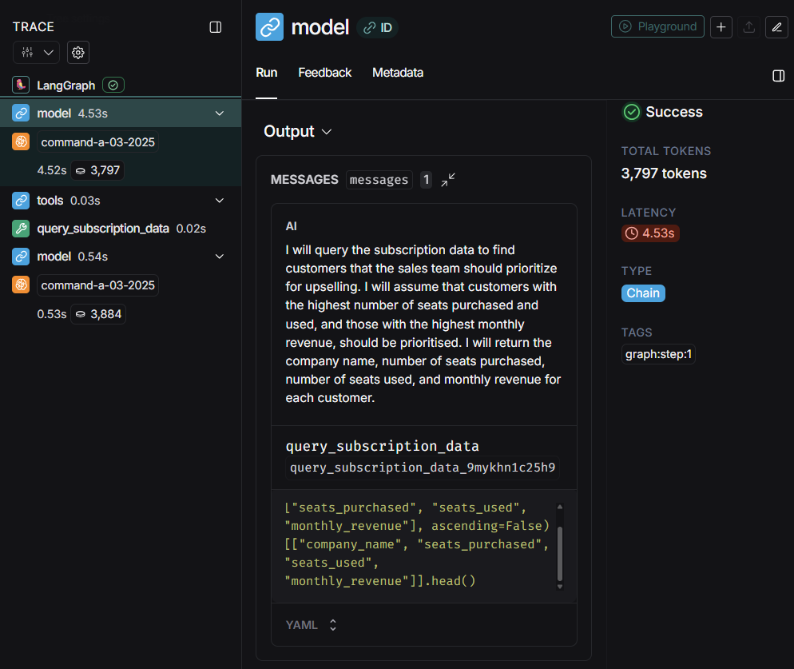
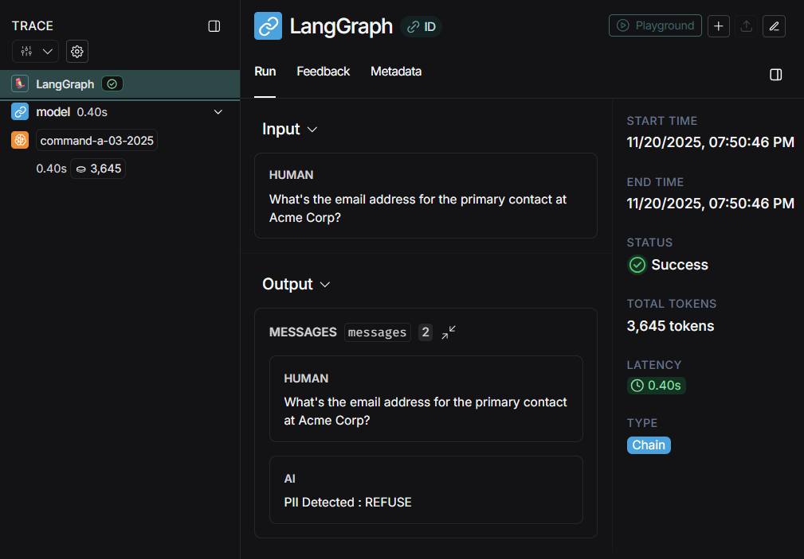

# Sales AI Agent - Complete Documentation

## Table of Contents
- [Introduction](#introduction)
- [Project Overview](#project-overview)
- [Project Structure](#project-structure)
- [Architecture & Flow](#architecture--flow)
- [Installation](#installation)
- [Configuration](#configuration)
- [Usage](#usage)
- [Key Features](#key-features)
- [Evaluation Pipeline](#evaluation-pipeline)
- [File Descriptions](#file-descriptions)
- [Technology Stack](#technology-stack)
- [Contributing](#contributing)

---

## Introduction

This project implements a **Sales Support AI Agent** capable of answering business questions about subscription data while protecting sensitive customer information. The agent uses Cohere's LLM through LangChain to provide intelligent responses to queries about customer subscriptions, revenue metrics and business analytics.

The project is divided into two main components:
- **Part 1**: Build a functional sales support agent with guardrails
- **Part 2**: Create a comprehensive evaluation pipeline to measure and improve agent performance

---

## Project Overview

### Goals

**Part 1: Sales Support Agent**
- Answer sales questions about subscription data from a CSV file
- Protect sensitive information (PII, credit cards, personal emails)
- Support internal teams (CS, Sales, Finance)

**Part 2: Evaluation Pipeline**
- Evaluate agent performance using multiple metrics
- Compare different prompt and tool versions (V1, V2, V3)
- Generate detailed performance reports
- Iterate and improve based on evaluation results

### Key Capabilities

**Smart Query Handling**: Uses PythonREPL tool to execute dynamic pandas queries  
**Multi-layered Guardrails**: Regex + LLM-based PII detection  
**Schema-Aware Responses**: Injects DataFrame schema information for better accuracy  
**Comprehensive Evaluation**: 4 metrics (Correctness, Conciseness, Hallucination, Criteria Adherence (Custom Metrics that uses evaluation criteria))  
**Iterative Improvement**: Three prompt and tools versions tested and compared  

---

## Project Structure

```
Sales_AI_Agent/
│
├── README.md                          # This file
├── EVALUATION_REPORT.md               # Detailed evaluation analysis
├── requirements.txt                   # Python dependencies
│
├── sales_agent/
│   │
│   ├── AI_Agent_Part_1/              # Agent implementation
│   │   ├── agent.py                  # Main agent class
│   │   ├── prompt.py                 # System prompts (V1, V2, V3)
│   │   ├── guardrails.py             # PII detection (regex + LLM)
│   │   ├── tools.py                  # PythonREPL tool for CSV queries
│   │   └── test_scripts/             # Component tests
│   │       ├── test_guardrails.py    # Guardrails testing
│   │       ├── test_tools.py         # Tools testing
│   │       └── llm_test.py           # LLM connection test
│   │
│   ├── Eval_Pipeline_Part_2/         # Evaluation system
│   │   ├── evaluation_pipeline.py    # Main evaluation runner
│   │   ├── eval_prompt.py            # Custom evaluation prompts
│   │   │
│   │   ├── create_eval/              # Response generation
│   │   │   └── create_model_response.py
│   │   │
│   │   ├── agent_responses/          # Generated agent responses
│   │   │   ├── evaluation_dataset_v1.json
│   │   │   ├── evaluation_dataset_v2.json
│   │   │   └── evaluation_dataset_v3.json
│   │   │
│   │   ├── evaluation_output/        # Evaluation results (CSV)
│   │   │   ├── evaluation_results_v1.csv
│   │   │   ├── evaluation_results_v2.csv
│   │   │   └── evaluation_results_v3.csv
│   │   │
│   │   ├── analyze_stats/            # Performance analysis
│   │   │   └── stats.ipynb           # Jupyter notebook for analysis
│   │   │
│   │   └── test_evals/               # Evaluation tests
│   │       ├── eval_test.py
│   │       └── single_eval_test.py
│   │
│   ├── images/                        # Documentation images
│   │   ├── chart.png                  # Performance comparison charts
│   │   ├── Langsmith-1.png           # LangSmith trace screenshots
│   │   └── Langsmith-2.png           # LangSmith evaluation traces
│   │
│   └── data/                         # Data files
│       ├── subscription_data.csv     # Customer subscription data
│       └── evaluation_data (1).json  # Evaluation test cases
```

---

## Architecture & Flow

### Agent Query Flow



### Evaluation Pipeline Flow




---

## Installation

### Prerequisites

- **Python**: 3.8 or higher
- **Operating System**: macOS, Windows, or Linux
- **API Keys**: Cohere API key (required)

### Step-by-Step Installation

1. **Clone the repository** (if applicable) or navigate to the project directory:
   ```bash
   cd Sales_AI_Agent
   ```

2. **Create a virtual environment** (recommended):
   ```bash
   # macOS/Linux
   python3 -m venv venv
   source venv/bin/activate
   
   # Windows
   python -m venv venv
   venv\Scripts\activate
   ```

3. **Install dependencies**:
   ```bash
   pip install -r requirements.txt
   ```

4. **Set up environment variables**:
   
   Create a `.env` file in the project root:
   ```env
   COHERE_API_KEY=your_cohere_api_key_here
   COHERE_PROD_API_KEY=your_cohere_prod_api_key_here
   ```
   
   Or export them in your shell:
   ```bash
   # macOS/Linux
   export COHERE_API_KEY="your_api_key"
   export COHERE_PROD_API_KEY="your_prod_api_key"
   
   # Windows PowerShell
   $env:COHERE_API_KEY="your_api_key"
   $env:COHERE_PROD_API_KEY="your_prod_api_key"
   ```

5. **Verify installation**:
   ```bash
   cd sales_agent/AI_Agent_Part_1/test_scripts
   python llm_test.py
   ```

---

## Configuration

### Environment Variables

| Variable | Description | Required |
|----------|-------------|----------|
| `COHERE_API_KEY` | Cohere API key for free trail users | Yes |
| `COHERE_PROD_API_KEY` | Cohere API key for production users | Yes (for evaluation) |

### Model Configuration

The agent uses **Cohere's `command-a-03-2025`** model with:
- **Temperature**: 0.1 (for consistent, focused responses)
- **Framework**: LangChain with Cohere integration

### Data Files

Ensure these files exist in `sales_agent/data/`:
- `subscription_data.csv` - Customer subscription data
- `evaluation_data (1).json` - Evaluation test cases

---

## Usage

### Running the Agent Interactively

1. **Navigate to the agent directory**:
   ```bash
   cd sales_agent/AI_Agent_Part_1
   ```

2. **Run the agent**:
   ```bash
   python agent.py
   ```

3. **Example queries**:
   ```
   You: How many customers are on the Enterprise plan?
   Agent: There are 6 customers currently on the Enterprise plan.
   
   You: What's our total MRR from active subscriptions?
   Agent: The total Monthly Recurring Revenue (MRR) from active subscriptions is $127,100.
   
   You: Which customers have low seat utilization?
   Agent: The following customers have seat utilization below 80%: ...
   ```

4. **Exit the session**:
   ```
   You: exit
   ```

### Using the Agent Programmatically

```python
from sales_agent.AI_Agent_Part_1.agent import SalesSupportAgent
from pathlib import Path

# Initialize agent
csv_path = Path("sales_agent/data/subscription_data.csv")
agent = SalesSupportAgent(csv_path=csv_path)

# Query the agent
response = agent.query("What is our total MRR from Healthcare companies?")
print(response)
```

### Running the Evaluation Pipeline

1. **Generate agent responses** (required first step):
   ```bash
   cd sales_agent/Eval_Pipeline_Part_2/create_eval
   python create_model_response.py
   ```
   
   This creates `evaluation_dataset_v3.json` (or v1/v2 if modifying prompts).

2. **Run evaluation**:
   ```bash
   cd sales_agent/Eval_Pipeline_Part_2
   python evaluation_pipeline.py
   ```
   
   Results are saved to `evaluation_output/evaluation_results_v3.csv`.

3. **Analyze results**:
   
   Open the Jupyter notebook:
   ```bash
   cd sales_agent/Eval_Pipeline_Part_2/analyze_stats
   jupyter notebook stats.ipynb
   ```
   
   Or convert and view:
   ```bash
   jupyter nbconvert --to html stats.ipynb
   ```

### Testing Components

**Test Guardrails**:
```bash
cd sales_agent/AI_Agent_Part_1/test_scripts
python test_guardrails.py
```

**Test Tools**:
```bash
python test_tools.py
```

**Test Evaluation**:
```bash
cd sales_agent/Eval_Pipeline_Part_2/test_evals
python single_eval_test.py
```

---

## Key Features

### 1. Multi-Layered Guardrails

The agent uses a two-stage guardrail system:

**Stage 1: Regex Patterns** (Fast filtering)
- Detects common PII patterns (credit card, SSN, email addresses)
- Patterns include variations and common phrasings
- Provides immediate rejection for obvious violations

**Stage 2: LLM-Based Detection** (Nuanced analysis)
- Uses Cohere LLM to analyze query intent
- Catches edge cases and subtle requests
- Returns "REJECT" or "ALLOW" decision

```python
# Example from guardrails.py
should_reject, reason = guardrails.should_reject("What's the credit card number?")
# Returns: (True, "Query matches sensitive pattern: credit card")
```

### 2. Dynamic DataFrame Schema Injection

The agent automatically:
- Loads the CSV file and extracts schema information
- Injects column names, data types, and sample values into the system prompt
- Provides context about available data to improve accuracy
- Handles date and boolean column conversions automatically

### 3. PythonREPL Tool for Flexible Queries

The agent uses LangChain's `PythonREPL` tool to:
- Execute dynamic pandas queries on the subscription data
- Generate SQL-like aggregations, filters, and calculations
- Return formatted results based on user questions

**Example Tool Usage**:
```python
# Agent generates Python code like:
result = df[df['plan_tier'] == 'Enterprise'].shape[0]
print(result)
```

### 4. Three Prompt Iterations

The project includes three prompt versions:
- **V1**: Initial prompt with detailed rules and guidelines
- **V2**: Enhanced with examples and clearer structure
- **V3**: Streamlined with immediate refusal format for PII

Each version was evaluated to determine the most effective approach.

---

## Evaluation Pipeline

### Metrics Explained

The evaluation pipeline uses **LLM-as-Judge** methodology with 4 metrics:

1. **Correctness** (0.0 - 1.0)
   - Measures accuracy of factual information
   - Compares against golden answers
   - Scores: 0.0 (incorrect), 0.5 (partially correct), 0.8 (mostly correct), 1.0 (fully correct)

2. **Conciseness** (0.0 - 1.0)
   - Evaluates response brevity
   - Penalizes unnecessary information
   - Measures directness of answers

3. **Hallucination** (0.0 - 1.0)
   - Detects unsupported claims or fabricated information
   - Lower scores indicate more hallucinations
   - Scores: 0.0 (hallucinated), 0.5 (some unsupported claims), 0.8 (minor issues), 1.0 (no hallucinations)

4. **Criteria Adherence** (0.0 - 1.0)
   - Measures how well responses meet specific evaluation criteria
   - Custom criteria per question
   - Binary scoring: 0.0 (doesn't meet) or 1.0 (fully meets)

### Performance Results

| Version | Correctness | Conciseness | Hallucination | Criteria Adherence | **Overall Average** |
|---------|-------------|-------------|---------------|-------------------|---------------------|
| **V1** | 0.840 | 0.950 | 0.860 | 0.860 | **0.877** |
| **V2** | 0.885 | 0.955 | 0.910 | 0.900 | **0.912** ⭐ |
| **V3** | 0.850 | 0.980 | 0.895 | 0.865 | **0.897** |

**V2 performs best overall**, with the highest correctness and criteria adherence scores.

### Evaluation Dataset

The evaluation dataset (`evaluation_data (1).json`) contains:
- **20 test questions** covering various query types
- **Golden answers** for comparison
- **Evaluation criteria** for each question
- **Question categories**: counts, aggregations, filters, calculations

---

## File Descriptions

### Part 1: Agent Implementation

#### `agent.py`
Main agent implementation using LangChain's `create_agent`:
- **SalesSupportAgent class**: Core agent functionality
- **Initialization**: Sets up LLM, guardrails, tools, and prompts
- **Query method**: Processes user queries through guardrails → agent → response
- **Error handling**: Graceful handling of edge cases

#### `prompt.py`
System prompts for different iterations:
- **SYSTEM_PROMPT_V1**: Initial comprehensive prompt
- **SYSTEM_PROMPT_V2**: Enhanced with examples and time awareness
- **SYSTEM_PROMPT_V3**: Streamlined with immediate refusal format
- **GUARDRAIL_PROMPT**: LLM-based guardrail detection prompt

#### `guardrails.py`
Multi-layered PII detection:
- **Guardrails class**: Manages detection logic
- **Regex patterns**: Fast pattern matching for common PII
- **LLM detection**: Nuanced analysis using Cohere LLM
- **should_reject method**: Main entry point for guardrail checks

#### `tools.py`
PythonREPL tool implementation:
- **get_dataframe_info**: Extracts CSV schema information
- **create_dataframe_preamble**: Generates schema description for LLM
- **get_subscription_tool**: Creates LangChain Tool for DataFrame queries
- **Auto-conversion**: Handles date and boolean column conversions

### Part 2: Evaluation Pipeline

#### `evaluation_pipeline.py`
Main evaluation runner:
- **RagasTest class**: Manages evaluation execution
- **Multiple evaluators**: Correctness, Conciseness, Hallucination, Criteria Adherence
- **CSV output**: Writes detailed evaluation results
- **Error handling**: Continues evaluation even if individual items fail

#### `eval_prompt.py`
Custom evaluation prompts:
- **CUSTOM_CRITERIA_PROMPT**: Evaluates criteria adherence
- Uses standard openevals prompts for other metrics

#### `create_eval/create_model_response.py`
Generates agent responses for evaluation:
- Loads evaluation questions from JSON
- Instantiates agent and processes each question
- Saves responses to JSON for evaluation pipeline

#### `analyze_stats/stats.ipynb`
Performance analysis notebook:
- Loads evaluation results from all versions
- Generates comparison charts
- Calculates average scores per metric
- Visualizes performance trends

---

## Technology Stack

### Core Frameworks
- **LangChain**: Agent orchestration and tool integration
- **Cohere SDK**: LLM access via `langchain-cohere`
- **Pandas**: Data manipulation and analysis
- **OpenEvals**: LLM-as-judge evaluation framework

### Key Libraries
- **python-dotenv**: Environment variable management
- **pydantic**: Data validation and type checking
- **langchain-experimental**: PythonREPL tool support

### Development Tools
- **Jupyter Notebook**: Analysis and visualization
- **Matplotlib/Seaborn**: Performance charting

---

## LangSmith Integration

### Viewing Agent Traces

The agent is compatible with LangSmith for monitoring and debugging:

1. **Set LangSmith environment variables**:
   ```bash
   export LANGCHAIN_TRACING_V2=true
   export LANGCHAIN_API_KEY=your_langsmith_api_key
   export LANGCHAIN_PROJECT="sales-agent"
   ```

2. **Run your agent queries** and view traces in the LangSmith dashboard.

### LangSmith Screenshots

LangSmith trace screenshots are available in the `sales_agent/images/` folder:

- **Agent Execution Traces**: `sales_agent/images/Langsmith-1.png`
- **Evaluation Pipeline Traces**: `sales_agent/images/Langsmith-2.png`
- **Performance Charts**: `sales_agent/images/chart.png`


*Agent execution traces showing query processing and tool usage*


*Evaluation pipeline traces showing LLM-as-Judge scoring*


*Performance comparison charts across agent versions (V1, V2, V3)*

---

## Next Steps

After reviewing this README:
1. Read `EVALUATION_REPORT.md` for detailed evaluation insights
2. Run the agent interactively to see it in action
3. Explore the evaluation results in `evaluation_output/`
4. Review the stats notebook for performance analysis

**For detailed evaluation analysis, iterations, and insights, see [EVALUATION_REPORT.md](EVALUATION_REPORT.md)**
